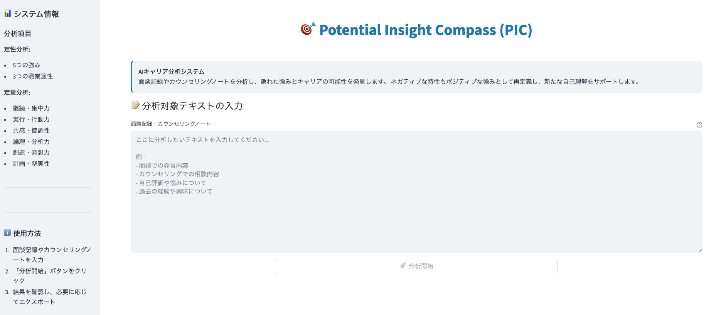
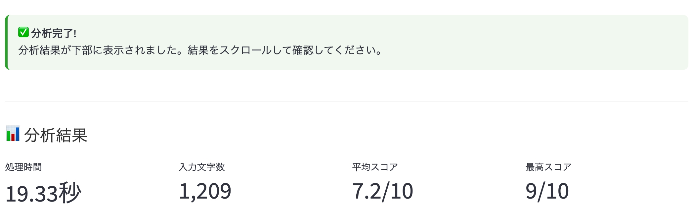
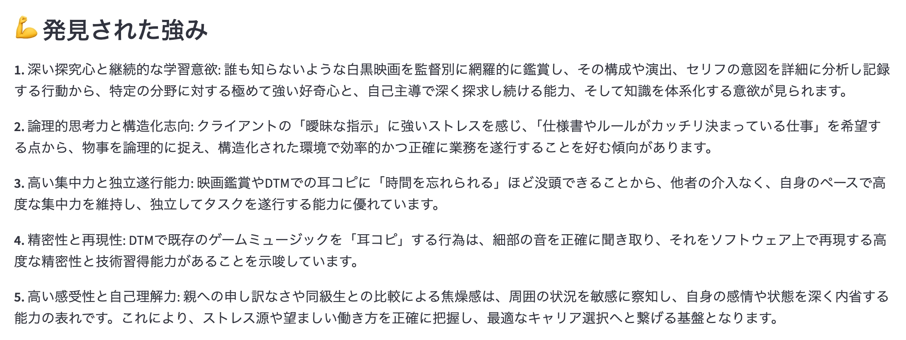
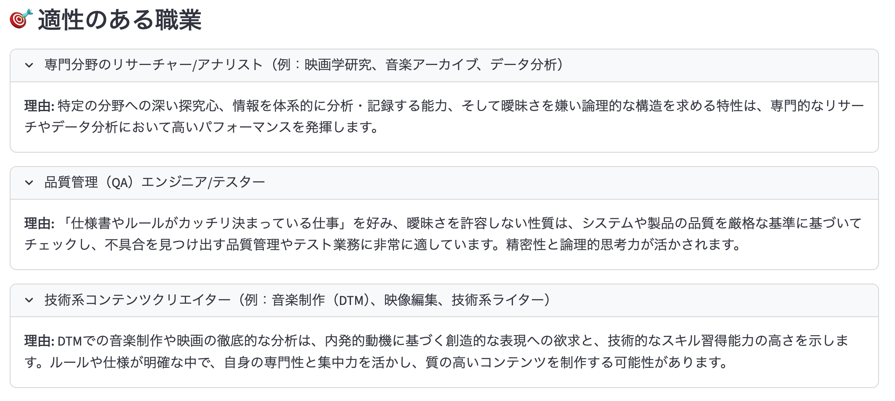
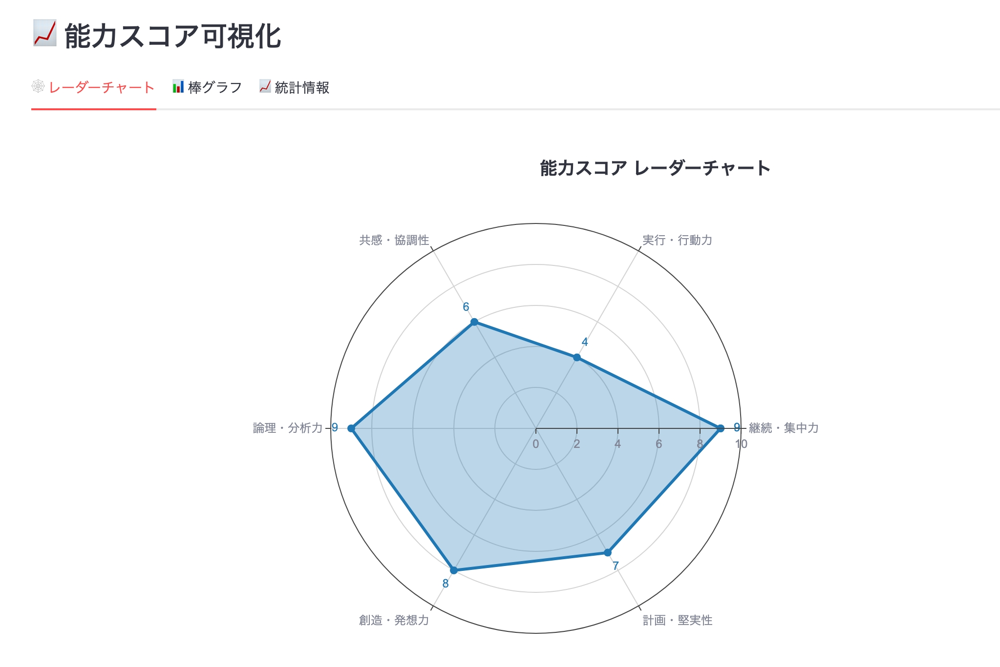
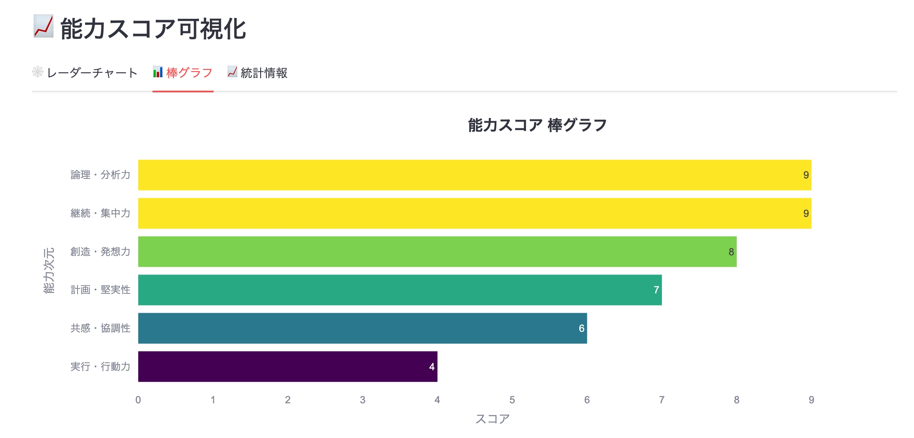
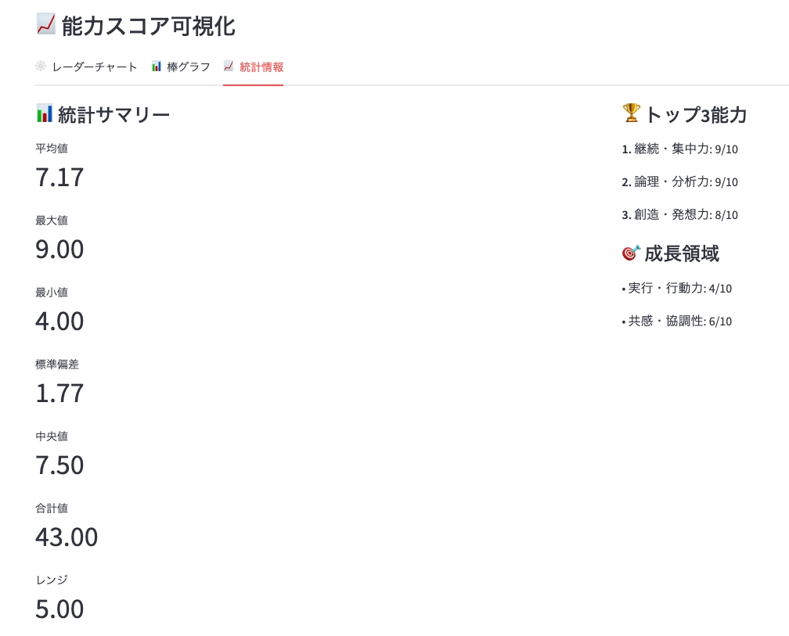
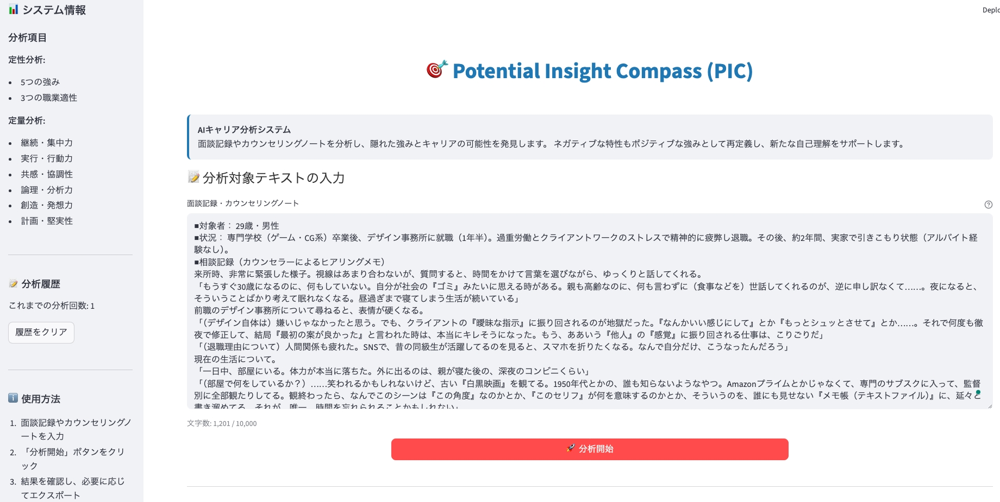

# Potential Insight Compass (PIC)

## 🎯 概要

Potential Insight Compass (PIC) は、面談記録やカウンセリングノートを分析し、隠れた強みとキャリアの可能性を発見するAI搭載のキャリアカウンセリング支援システムです。Google Gemini APIを活用して、ネガティブな自己認識をポジティブな洞察に変換し、個人の能力を定性的・定量的の両面から分析します。


*テキスト入力と分析オプションを表示するメインアプリケーションインターフェース*

## ✨ 主要機能

- **AI駆動分析**: Google Gemini APIを活用した客観的で一貫性のある分析
- **ポジティブリフレーミング**: ネガティブな特性を潜在的な強みに変換
- **二面的視点**: 定性的洞察と定量的可視化の両方を提供
- **インタラクティブチャート**: 6次元能力スコアを表示するレーダーチャート
- **ユーザーフレンドリーインターフェース**: 直感的な操作のためのStreamlit構築







*定性的洞察と定量的可視化を示すサンプル分析結果*

## 🏗️ リポジトリ構造

```
potential-insight-compass/
├── .env                    # 環境変数（コミット禁止）
├── .env.example           # 環境変数テンプレート
├── .gitignore            # Git無視ルール
├── LICENSE               # MITライセンス
├── README.md             # 英語版README
├── README-ja.md          # このファイル（日本語版）
├── SPECIFICATION.md      # 詳細システム仕様書（日本語）
├── requirements.txt      # Python依存関係
├── app.py               # メインStreamlitアプリケーション
├── _images/             # UIスクリーンショットとデモ画像
│   ├── mainpage1.jpeg    # メインインターフェーススクリーンショット
│   ├── analysisResult*.jpeg # 分析結果例
│   └── resultExport.jpeg # エクスポート機能デモ
├── docs/                # ドキュメント
│   ├── code-documentation.md # 詳細コードドキュメント
│   └── api-reference.md     # APIリファレンスガイド
├── src/                 # ソースコードディレクトリ
│   ├── __init__.py
│   ├── ai_analyzer.py   # Gemini API統合
│   ├── data_processor.py # データ処理ユーティリティ
│   └── visualizer.py    # チャート生成機能
└── tests/              # テストファイル
    ├── __init__.py
    └── test_analyzer.py # アナライザーのユニットテスト
```

## 🚀 クイックスタート

### 前提条件

- Python 3.12.4以上
- Google AI Studio API キー（[こちらで取得](https://aistudio.google.com/)）
- Git

### インストール

1. **リポジトリをクローン**
   ```bash
   git clone https://github.com/yf591/potential-insight-compass.git
   cd potential-insight-compass
   ```

2. **仮想環境の作成と有効化** ⚠️ **重要**
   ```bash
   # 仮想環境を作成
   python3 -m venv .venv
   
   # 仮想環境を有効化（macOS/Linux）
   source .venv/bin/activate
   
   # 仮想環境を有効化（Windows）
   .venv\Scripts\activate
   ```

3. **依存関係をインストール**
   ```bash
   # 仮想環境が有効化されていることを確認
   pip install --upgrade pip
   pip install -r requirements.txt
   ```

4. **環境変数を設定**
   ```bash
   # 環境変数テンプレートをコピー
   cp .env.example .env
   
   # .envを編集してGoogle Gemini APIキーを追加
   # GEMINI_API_KEY=your_api_key_here
   ```

5. **アプリケーションを実行**
   ```bash
   # 仮想環境が有効化されていることを確認
   streamlit run app.py
   ```

### 環境設定の詳細

> **🔴 重要**: システム全体のパッケージ競合を避けるため、常に仮想環境内で作業してください。

**すべての操作の前に、必ず仮想環境を有効化してください。**
```bash
source .venv/bin/activate
```

**仮想環境を無効化するには**
```bash
deactivate
```

**仮想環境内にいることを確認するには**
```bash
which python  # .venvを含むパスが表示されるはず
python --version  # Python 3.12.4が表示されるはず
```

## 🔧 設定

### 環境変数

プロジェクトルートに以下の変数を含む`.env`ファイルを作成してください。

```env
# Google Gemini API Key（必須）
GEMINI_API_KEY=your_gemini_api_key_here

# ngrok Token（オプション - 外部アクセステスト用）
NGROK_TOKEN=your_ngrok_token_here
```

### APIキーの設定

1. [Google AI Studio](https://aistudio.google.com/)にアクセス
2. 新しいAPIキーを作成
3. キーをコピーして`.env`ファイルに追加
4. `.env`ファイルは絶対にバージョン管理にコミットしないでください

## 🎮 使用方法

1. **アプリケーションを開始**
   ```bash
   source .venv/bin/activate  # まず必ず有効化！
   streamlit run app.py
   ```

2. **Webインターフェースにアクセス**
   - ブラウザで`http://localhost:8501`を開く

3. **分析テキストを入力**
   - カウンセリングノートや面談記録をテキストエリアに貼り付け
   - 「**分析開始**」**をクリック**して入力を処理
  

4. **結果を確認**
   - **定性分析**: 5つの強みと3つのキャリア推奨
  
  
  
   - **定量分析**: 6つの能力次元を持つインタラクティブレーダーチャート
  
  
  


*分析結果をJSONまたはMarkdown形式でエクスポート*

## 📊 分析次元

システムは6つの主要次元で個人を評価します。

1. **継続・集中力** (持続性と集中力)
2. **実行・行動力** (実行力と行動力)
3. **共感・協調性** (共感力と協調性)
4. **論理・分析力** (論理性と分析力)
5. **創造・発想力** (創造性と革新性)
6. **計画・堅実性** (計画性と信頼性)

## 🧪 開発

### テストの実行
```bash
source .venv/bin/activate
python -m pytest tests/
```

### コード品質
```bash
source .venv/bin/activate
# リンティング
flake8 src/
# 型チェック
mypy src/
```

### 依存関係の追加
```bash
source .venv/bin/activate
pip install new-package
pip freeze > requirements.txt
```

## 🛠️ システム詳細

### アーキテクチャ

本システムは以下の主要コンポーネントで構成されています。

- **AIAnalyzer**: Google Gemini APIとの統合とテキスト分析
- **DataProcessor**: データの前処理、検証、変換
- **ChartVisualizer**: Plotlyによるインタラクティブな可視化
- **Streamlit App**: ユーザーインターフェースとアプリケーションフロー

### 技術スタック

- **フロントエンド**: Streamlit 1.28.0+
- **AI エンジン**: Google Gemini API (gemini-2.5-flash)
- **可視化**: Plotly 5.15.0+
- **データ処理**: Pandas 2.0.0+
- **環境管理**: python-dotenv 1.0.0+

## 🤝 貢献

1. リポジトリをフォーク
2. 機能ブランチを作成（`git checkout -b feature/amazing-feature`）
3. 仮想環境内で変更を行う
4. 変更をコミット（`git commit -m 'Add amazing feature'`）
5. ブランチにプッシュ（`git push origin feature/amazing-feature`）
6. プルリクエストを開く

## 📄 ライセンス

このプロジェクトはMITライセンスの下でライセンスされています - 詳細については[LICENSE](LICENSE)ファイルを参照してください。

## 🙏 謝辞

- 強力な言語処理のためのGoogle Gemini API
- 優れたWebフレームワークのためのStreamlit
- 美しいデータ可視化のためのPlotly

## 📚 ドキュメント

- **[コードドキュメント](docs/code-documentation.md)**: すべてのモジュールと関数の詳細説明
- **[APIリファレンス](docs/api-reference.md)**: 例付きの完全なAPIリファレンス
- **[システム仕様書](SPECIFICATION.md)**: 技術仕様（日本語）
- **[English README](README.md)**: English version README

## 📞 サポート

問題が発生したり質問がある場合は、
1. 詳細な技術情報については[ドキュメント](docs/)を確認
2. システム要件については[SPECIFICATION.md](SPECIFICATION.md)を確認
3. GitHubでissueを開く
4. バグ報告時は仮想環境内で作業していることを確認

---

**⚠️ 注意: このプロジェクトで作業する前に、必ず仮想環境を有効化してください！**

```bash
source .venv/bin/activate
```

## 🚀 発展的な使用例

### プログラマティックな使用

```python
from src.ai_analyzer import AIAnalyzer
from src.data_processor import DataProcessor
from src.visualizer import ChartVisualizer

# 初期化
analyzer = AIAnalyzer()
processor = DataProcessor()
visualizer = ChartVisualizer()

# 分析実行
input_text = "面談記録のテキスト..."
result = analyzer.analyze_text(input_text)
processed = processor.process_analysis_result(input_text, result)

# 可視化
chart = visualizer.create_radar_chart(processed.scores_df)
```

### バッチ処理

複数のテキストファイルを一括処理する場合

```python
import glob
from pathlib import Path

# テキストファイルを一括処理
text_files = glob.glob("data/*.txt")
results = []

for file_path in text_files:
    with open(file_path, 'r', encoding='utf-8') as f:
        text = f.read()
    
    result = analyzer.analyze_text(text)
    processed = processor.process_analysis_result(text, result)
    results.append(processed)

# 結果をエクスポート
for i, processed_data in enumerate(results):
    json_output = processor.export_to_json(processed_data)
    with open(f"output/result_{i}.json", 'w', encoding='utf-8') as f:
        f.write(json_output)
```

## 🔍 トラブルシューティング

### よくある問題

1. **APIキーエラー**
   - `.env`ファイルが正しく設定されているか確認
   - APIキーが有効で期限切れでないか確認

2. **依存関係エラー**
   - 仮想環境が有効化されているか確認
   - `pip install -r requirements.txt`を再実行

3. **ポートエラー**
   - 8501ポートが使用中の場合は`streamlit run app.py --server.port 8502`で別ポートを使用

4. **文字化け**
   - テキストファイルがUTF-8エンコーディングで保存されているか確認

### デバッグモード

詳細なログを有効にするには

```bash
streamlit run app.py --logger.level debug
```

### パフォーマンス最適化

大量のテキスト処理時
- テキストを適切なサイズ（1000-5000文字）に分割
- APIレート制限を考慮して適切な間隔でリクエスト
- 結果をキャッシュして再処理を避ける